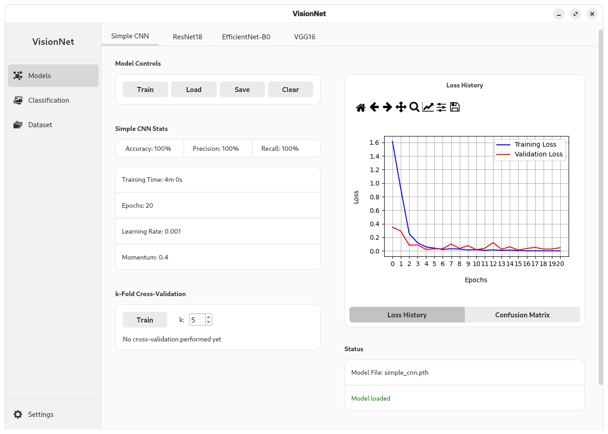
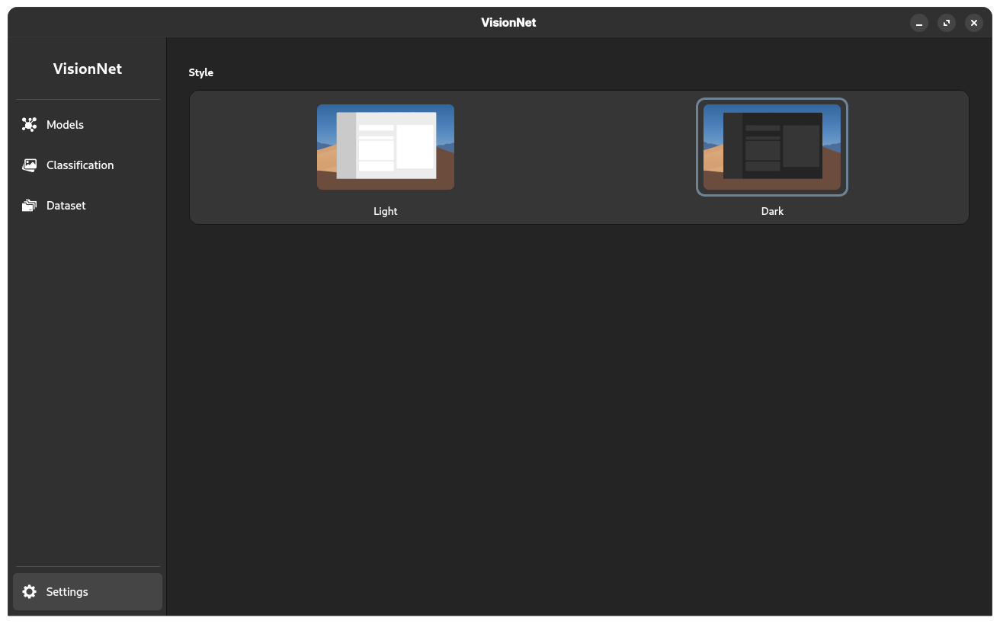

# VisionNet 🧠

A user-friendly desktop application for training and evaluating image classification models, built with PyTorch and PyQt6.

Originally designed to classify fruits and vegetables, VisionNet has been generalized to support any image classification dataset. It provides an intuitive graphical interface that simplifies the process of loading datasets, training various neural network models, and assessing their performance.

## ✨ Key Features

VisionNet is designed with a strong focus on user experience, providing a seamless workflow for deep learning practitioners and enthusiasts.

*   **Intuitive Graphical Interface:** A clean, modern, and easy-to-navigate UI built with PyQt6 that streamlines the machine learning workflow.
*   **Effortless Dataset Management:** Easily load, visualize, and manage your image datasets. The application expects a standard `train/test/valid` directory structure.
*   **Multiple Model Support:** Comes with several pre-configured models ready for training:
    *   `ResNet18`
    *   `EfficientNet-B0`
    *   `VGG16`
    *   `SimpleCNN` (a custom baseline model)
*   **Interactive Model Training:** Train models on your own datasets with customizable hyperparameters (e.g., learning rate, epochs, batch size).
*   **Real-time Performance Visualization:** Monitor the training process with live-updating loss and accuracy graphs. After training, evaluate model performance with a clear and insightful confusion matrix.
*   **Instant Classification:** Use your trained models to classify individual images with a simple drag-and-drop interface.
*   **Model Persistence:** Save your trained model weights and load them later for further evaluation or inference.
*   **Customizable Theming:** Switch between a light and dark mode to suit your visual preference and reduce eye strain during late-night sessions.

## 📸 Screenshots

*Training a SimpleCNN model and viewing metrics.*


*Training a VGG16 model.*


*Classifying an image with a trained model.*


*Managing and visualizing the dataset.*


*Application settings, including theme selection.*


## ⚙️ Installation

Follow these steps to run the application on your local machine.

1.  **Clone the repository:**
    ```bash
    git clone https://github.com/YOUR_USERNAME/VisionNet.git
    cd VisionNet
    ```
    *(Remember to replace `YOUR_USERNAME` with your GitHub username)*

2.  **Install dependencies:**
    Ensure you have Python (version 3.10+ recommended) and pip installed.
    ```bash
    pip install -r requirements.txt
    ```

## 🔮 Future Roadmap

We are constantly working to improve VisionNet. Here are some features planned for future releases:

*   **Custom Neural Network Builder:** Instead of relying only on a `SimpleCNN`, users will be able to design their own neural network architectures through the UI. Configurable parameters will include:
    *   Number and type of layers (Convolutional, Pooling, Fully Connected)
    *   Number of filters, kernel size, stride
    *   Activation functions (ReLU, Sigmoid, etc.)
    *   Dropout rates
*   **Expanded Model Library:** We plan to integrate more pre-trained models from libraries like `torchvision`. Users will be able to select which models they want to work with via a settings panel, keeping the interface clean and tailored to their needs.
*   **Code Refactoring:** Ongoing efforts to refactor the codebase for better performance, scalability, and maintainability.

## 📝 License

This project is not under any license.
