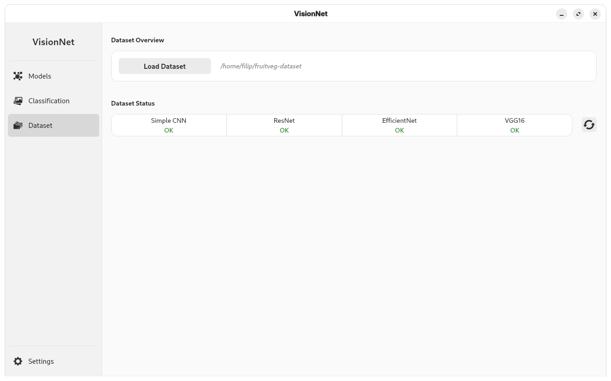
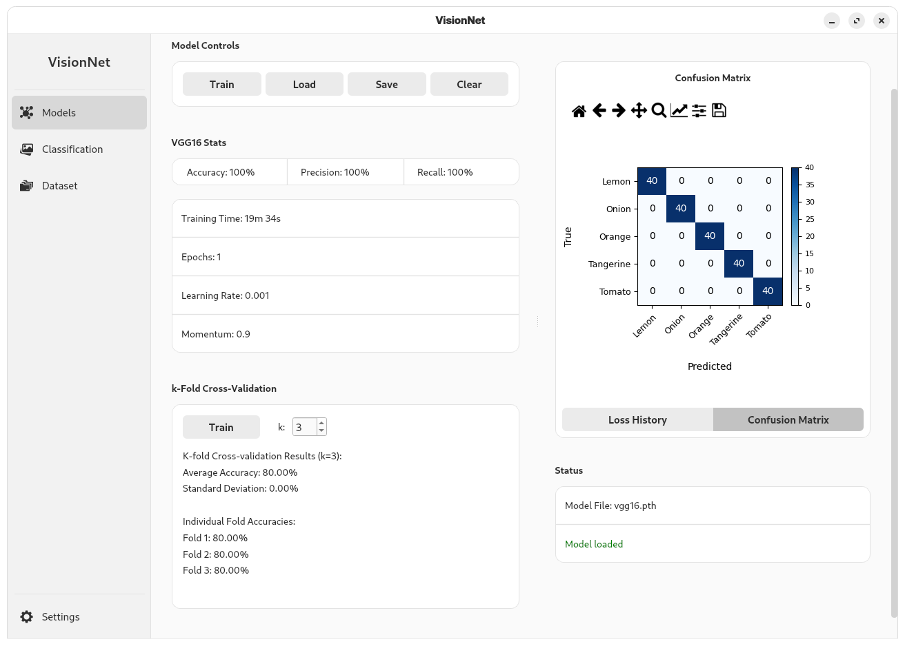
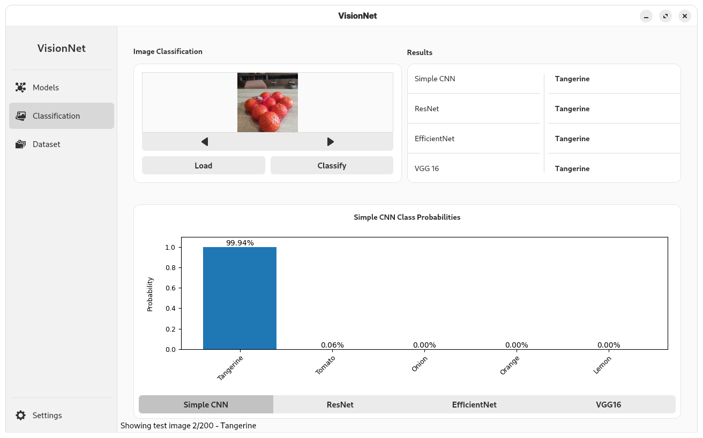

# FruitVegNet 🍎🥦

**Desktopová aplikace pro rozpoznávání ovoce a zeleniny v síťovaných sáčcích pomocí deep learningu.**

Tato aplikace, vyvinutá v rámci diplomové práce, využívá knihovnu PyTorch pro klasifikaci produktů. Nabízí uživatelsky přívětivé rozhraní vytvořené pomocí PyQt6, které uživatelům umožňuje načítat datasety, trénovat různé modely neuronových sítí a vyhodnocovat jejich výkon.

## ✨ Klíčové funkce

*   **Intuitivní grafické rozhraní:** Čisté a jednoduché rozhraní vytvořené pomocí PyQt6.
*   **Správa datasetu:** Načítání a vizualizace datasetu.
*   **Podpora více modelů:** Předpřipravené modely `ResNet18`, `EfficientNet-B0`, `VGG16` a vlastní `SimpleCNN`.
*   **Trénování vlastních modelů:** Možnost trénovat modely na vlastních datasetech s nastavitelnými hyperparametry.
*   **Vizualizace výkonu:** Sledování průběhu trénování pomocí grafů ztráty v reálném čase a zobrazení výsledků pomocí matice záměn.
*   **Klasifikace v reálném čase:** Možnost klasifikovat jednotlivé obrázky.
*   **Správa modelů:** Ukládání a načítání natrénovaných modelů pro pozdější použití.
*   **Světlý/Tmavý režim:** Přepínání mezi tématy pro vaše pohodlí.

## 📸 Screenshoty


*Správa a vizualizace datasetu.*


*Trénování modelu VGG16 a zobrazení metrik.*


*Klasifikace obrázku pomocí natrénovaného modelu.*

## ⚙️ Instalace

Postupujte podle těchto kroků pro spuštění aplikace na vašem lokálním počítači.

1.  **Naklonujte repozitář:**
    ```bash
    git clone https://github.com/YOUR_USERNAME/fruit-veg-net.git
    cd fruit-veg-net
    ```
    *(Nezapomeňte nahradit `YOUR_USERNAME` vaším GitHub jménem)*

2.  **Nainstalujte závislosti:**
    Ujistěte se, že máte nainstalovaný Python (doporučená verze 3.10+) a pip.
    ```bash
    pip install -r requirements.txt
    ```

## 🚀 Použití

1.  **Připravte dataset:**
    Vytvořte složku `dataset/fruitveg-dataset` v kořenovém adresáři projektu. Váš dataset musí mít následující strukturu:
    ```
    dataset/fruitveg-dataset
    ├── /train
    ├── /test
    └── /valid
    ```

2.  **Spusťte aplikaci:**
    ```bash
    python main.py
    ```

## 🧠 Modely

Aplikace podporuje několik předtrénovaných architektur z knihovny `torchvision` a také jeden vlastní model:
*   ResNet18
*   EfficientNet-B0
*   VGG16
*   SimpleCNN (jednoduchá konvoluční síť)

Program lze snadno rozšířit o další modely z `torchvision`.

## 📝 Licence

Tento projekt není pod žádnou licencí.
